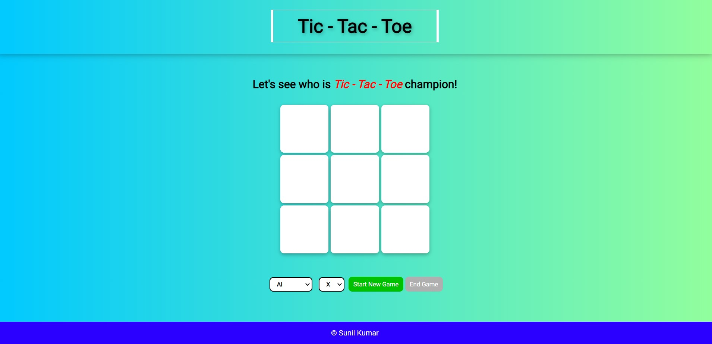
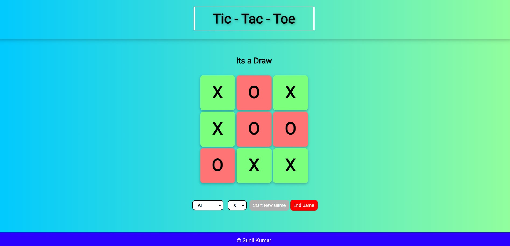
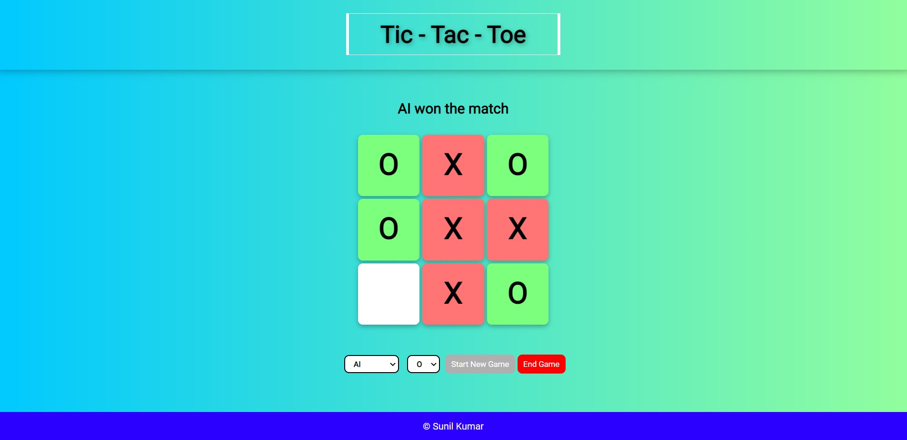

# Tic Tac Toe with AI using Minimax Algorithm
This is a Tic Tac Toe game created as an assignment for The odin Project full stack development. It contains an Artificial Intelligence algorithm which can play moves for the computer.

## Features of this game
* You can play with a opponent human player.
* You can play with computer AI.
* You can choose your symbol.
* You can end game at any time and start a new game.
* Simple to use.

## Learning Outcomes
* DOM manipulation using JavaScript.
* CSS grid and flexbox.
* Applying Minimax algorithm for the AI in game.
* Event listeners
* Factory methods and modules in JavaScript.
* Debugging using chrome developer console.

## Screenshots

